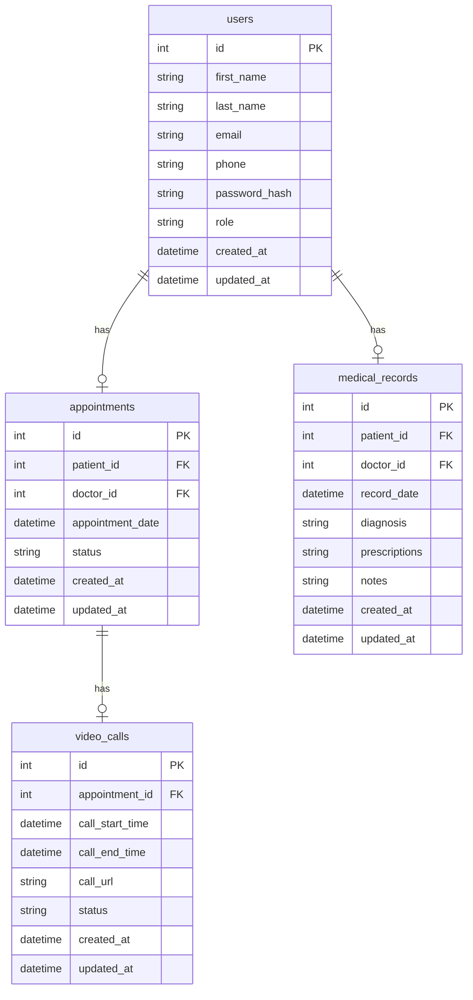

# Telemedicina

## ℹ️ General Info

Telemedicine application enabling patients to schedule virtual appointments, doctors to access medical records, and administrators to manage consultations and assign doctors, with secure video calls and efficient management.

## 🏭 Applications

-   [Backend](./backend) — Telemedicina application backend.

    _To work properly, fill in the **`.env`** file. Use the **`.env.example`** file as an example._

-   [Frontend](./frontend) — Telemedicina application frontend.

    _To work properly, fill in the **`.env`** file. Use the **`.env.example`** file as an example._

## 🖍 Requirements

-   [NodeJS](https://nodejs.org/en/) (20.x.x);
-   [NPM](https://www.npmjs.com/) (10.x.x);
-   [PostgreSQL](https://www.postgresql.org/) (16.4)

## 💽 DB Schema



## 🏃‍♂️ Simple Start

1. Install packages: **`npm install`**
2. Fill ENVs
3. Run migrations: **`npm run migrate:dev -w backend`**
4. Run backend: **`npm run start:dev -w backend`**
5. Run fronend: **`npm run start:dev -w frontend`**

## 🏗️ Architecture

### 🌑 Backend

-   [Express](https://expressjs.com/) — a backend framework.
-   [Sequelize](https://sequelize.org/) — an ORM.

### 🌕 Frontend

-   [Material UI](https://mui.com/) - a component library.

### 🥊 Code quality


#### 📝 Ticket flow

```
<type>:<short-desc>
```

##### Types

-   TASK
-   FEAT
-   FIX

##### Examples

-   `TASK : Create home page`
-   `FIX : Login form validation`


#### 🌳 Branch flow

```
<type>/<project-prefix>-<issue-number>-<short-desc>
```

##### Types

-   task
-   fix

##### project-prefix

-   TM

##### Examples

-   `task/TM-6-create-home-page`
-   `fix/TM-16-fix-login-form-validation`


#### 🗂 Commit flow

```
<project-prefix>-<issue-number>: <modifier> <description>
```

##### Modifiers

-   `+` (add)
-   `*` (edit)
-   `-` (remove)

##### Examples

-   `TM-6: + home page`
-   `TM-12: * login form validation`
-   `TM-16: - age field`


#### 🏅 Pull Request flow

```
<project-prefix>-<issue-number>: <ticket-title>
```

##### Example

-   `TM-5: Create home page`


## 📦 CI/CD
